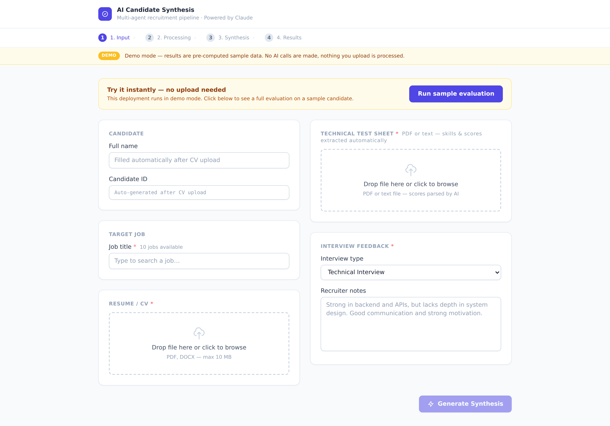
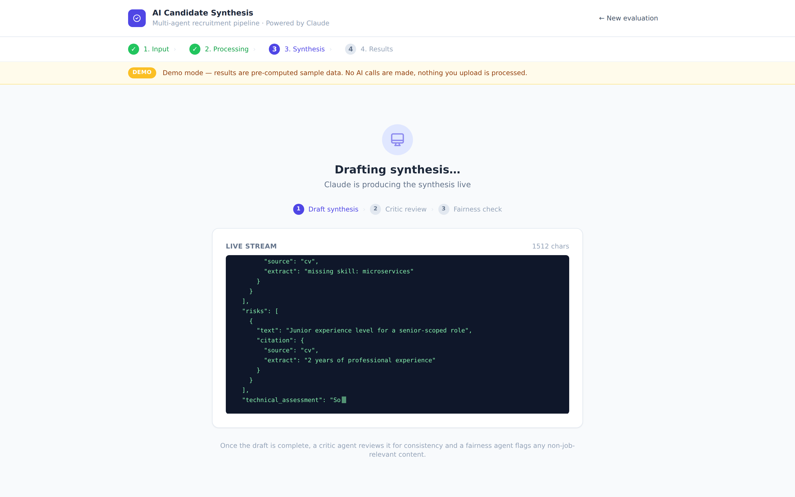
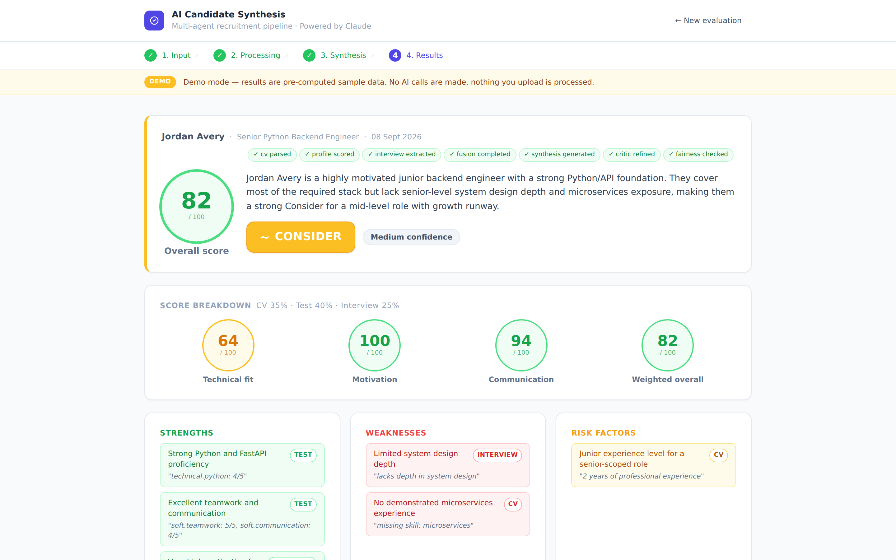

# AI Candidate Synthesis Agent

[](https://github.com/NCH04/candidate-synthesis-agent/actions/workflows/ci.yml)
[](LICENSE)

A multi-agent recruitment assistant that turns raw hiring evidence — a CV, a
technical test sheet, and free-form interview notes — into a single
**standardized, citation-backed, bias-checked candidate report**.

Originally built during a hackathon, now actively improved as a portfolio
project. All AI reasoning is powered by **Anthropic Claude**; semantic skill
matching runs locally via sentence-transformers.

---

## Screenshots

| Input | Live synthesis |
|---|---|
|  |  |



Regenerate them any time against a running demo instance:

```bash
python scripts/screenshots.py
```

---

## 1. Quick recap

Recruitment evaluation is fragmented across resumes, tests, interview notes,
and recruiter impressions. The result is inconsistent decisions, subjective
assessments, and weak comparability across candidates.

This project attacks the first half of that problem: it consolidates the three
evaluation sources for **one candidate** into a single explainable, structured
report, produced the same way every time — same dimensions, same 0-1 scales,
same citation format, same fairness pass. Two candidates evaluated by two
recruiters come out in a directly comparable shape.

It does **not** yet do the second half. Nothing is persisted: each run is
independent, there is no evaluation history and no side-by-side view. Those are
the next two items on the roadmap.

Per-candidate, the pipeline takes:

| Input              | Format                  | Processed by                                  |
|--------------------|-------------------------|-----------------------------------------------|
| CV / profile       | PDF / TXT               | `pdfplumber` + Claude (skill / experience extraction) |
| Technical test     | PDF / TXT evaluation form | Claude (score normalisation 1–5)            |
| Interview feedback | Free-form recruiter text | Claude (signal extraction)                  |

The pipeline runs **eight agents** in sequence:

1. **CV structure agent** – extracts skills / experience / education
2. **Skill matcher** – semantic cosine match against job-required skills (local embeddings)
3. **Profile/job scorer** – Claude evaluates overall fit and writes a short justification
4. **Test sheet parser** – Claude normalises competency scores
5. **Interview signal extractor** – Claude turns recruiter notes into structured signals
6. **Draft synthesis agent** – Claude produces the report, **with citations** linking each strength / weakness / risk to a source extract (CV, test, or interview)
7. **Critic agent** – a second Claude pass reviews the draft for inconsistencies, weak justifications, and decision/score misalignment, then emits the refined version
8. **Fairness reviewer** – Claude flags any non-job-relevant or potentially discriminatory content

The final report is **streamed live** to the UI via Server-Sent Events: the
recruiter watches the synthesis being produced in real time.

The pipeline is **cost-aware** by design: simple extraction runs on a cheap
model (Haiku) while only the reasoning steps use a stronger one (Sonnet),
test sheets in a standard layout are parsed for free with a regex, a
deterministic word-scan skips the fairness LLM call when nothing sensitive is
present, parsed CVs are cached by content hash, and an optional economy mode
drops the priciest pass. A **demo mode** serves pre-computed sample results
with **zero API calls** — ideal for a public deployment.

Every agent's JSON output is **validated against a Pydantic contract** before it
reaches the next stage, with one automatic retry that feeds the validation error
back to the model. A hallucinated shape fails loudly instead of reaching the UI.

### What the recruiter gets

- A clear **Hire / Consider / No Hire** decision with confidence level
- An overall score plus 4 dimension scores (technical, motivation, communication, weighted overall)
- Strengths / weaknesses / risks **with verbatim source citations**
- Skill match breakdown (matched / missing)
- Aggregated test scores by category
- A fairness review block flagging biased phrasing
- Recommended next steps tailored to the decision

### How the score is computed

Each dimension is a weighted average over the sources that actually carry a
signal for it, with the weights **renormalised to sum to 1**:

| Dimension           | Sources                                          |
|---------------------|--------------------------------------------------|
| `technical_fit`     | CV/job match + technical test items              |
| `motivation_fit`    | motivation test items + interview motivation signal |
| `communication_fit` | soft-skill test items + interview psychological signal |
| `overall_score`     | all three sources, test = mean of its scored buckets |

A dimension a source says nothing about is **dropped, not counted as zero**. A
test sheet listing only technical competencies therefore produces the same
overall score as a balanced one for the same candidate — the layout of the
evaluation form must never decide the hire. `test_assessment.scored_dimensions`
records which buckets the sheet actually scored.

---

## 2. Technologies

### Backend (`backend/`)

| Layer            | Stack                                                          |
|------------------|----------------------------------------------------------------|
| API framework    | FastAPI + Uvicorn                                              |
| Validation       | Pydantic v2                                                    |
| LLM              | Anthropic Claude (`claude-sonnet-5` + `claude-haiku-4-5`)      |
| PDF extraction   | `pdfplumber`                                                   |
| Semantic matching| `sentence-transformers` — `all-MiniLM-L6-v2` (local, no API)  |
| Streaming        | FastAPI `StreamingResponse` + SSE                              |
| Config           | `python-dotenv`                                                |

Service layout:

```
backend/
├── main.py                  # FastAPI app, endpoints, auth / rate limit / upload guards
├── schemas.py               # Pydantic contracts (assessment, report, citations, agent outputs)
├── jobs.json                # Local job catalogue (10 sample roles)
├── demo_data/sample.json    # Pre-computed sample used by DEMO_MODE
├── tests/                   # pytest suite — no API key, no network
└── services/
    ├── cv_service.py           # PDF → structured profile → score against job
    ├── llm_service.py          # All Claude agents + JSON validation & retry
    ├── skill_match_service.py  # Local embedding-based skill matching (lazy torch import)
    ├── test_parser_service.py  # Deterministic regex test-sheet parser
    ├── fairness_service.py     # Local sensitive-term pre-filter
    ├── jobs_service.py         # Job catalogue loader
    ├── demo_service.py         # Zero-API-call sample responses
    └── fusion_service.py       # Weighted fusion (CV 35% / Test 40% / Interview 25%)
```

### Frontend (`frontend/`)

| Layer       | Stack                                |
|-------------|--------------------------------------|
| Framework   | React 18 + TypeScript                |
| Build tool  | Vite                                 |
| Styling     | Tailwind CSS                         |
| Pages       | `InputPage` → `ProcessingPage` → `StreamingPage` → `ResultsPage` |
| Streaming   | Fetch + ReadableStream + SSE parser  |

### Architecture flow

```
                ┌─────────────┐
                │   InputPage │  CV + test sheet + interview text + job
                └──────┬──────┘
                       │ POST /api/candidate/pipeline/prepare
                       ▼
        ┌──────────────────────────────────┐
        │  CV parse → score → tests →      │  Steps 1-5 (server-side)
        │  interview signals → fusion      │
        └──────────────┬───────────────────┘
                       │ Assessment object
                       ▼
        ┌──────────────────────────────────┐
        │  POST /api/candidate/synthesis/stream │  SSE stream
        │  Claude draft → critic → fairness │
        └──────────────┬───────────────────┘
                       │ Tokens (delta) → final report
                       ▼
                ┌─────────────┐
                │ ResultsPage │  Citation-backed report + fairness flags
                └─────────────┘
```

---

## 3. User manual

### 3.1 Requirements

- Python 3.10+
- Node.js 18+
- An **Anthropic API key** (single dependency for all AI features)

### 3.2 Setup — option A: one-command Docker

The simplest way to run the whole stack locally. Backend + built frontend in
one image, embedding model baked in.

```bash
git clone git@github.com:NCH04/candidate-synthesis-agent.git
cd candidate-synthesis-agent
cp .env.example .env                # then paste your ANTHROPIC_API_KEY
docker compose up --build
# → http://localhost:7860
```

First build takes ~5 min (Vite build + CPU-only torch + embedding model
pre-download). Subsequent builds use the layer cache and are much faster.

### 3.3 Setup — option B: native dev (hot reload)

Use this when developing the frontend or backend with hot reload.

```bash
git clone git@github.com:NCH04/candidate-synthesis-agent.git
cd candidate-synthesis-agent
cp .env.example .env                # paste your ANTHROPIC_API_KEY

# Backend
cd backend
python -m venv .venv && source .venv/bin/activate
pip install -r requirements.txt     # ~200 MB (sentence-transformers + torch)
uvicorn main:app --reload --port 8000

# Frontend (in a second terminal)
cd frontend
npm install
npm run dev                         # http://localhost:5173 — proxies /api → :8000
```

> **First launch note.** On the first backend request, `sentence-transformers`
> downloads the `all-MiniLM-L6-v2` model (~80 MB). Subsequent runs use the
> cached model. The Docker image pre-downloads it at build time so the first
> request is instant.

### 3.4 Running a full evaluation

1. **Open the app** at `http://localhost:5173`.
2. **Upload a CV** (PDF or plain text). The candidate's name is auto-extracted by Claude.
3. **Pick a target job** from the autocomplete (10 sample jobs ship with the project: backend, full-stack, DevOps, data, HR, finance, product, UX). The required skills hint appears below the field.
4. **Upload a technical test sheet** (PDF or text). Claude parses it and extracts competency scores on a 1-5 scale plus the list of target skills.
5. **Paste interview feedback** as free-form text and pick the interview type.
6. **Click _Generate Synthesis_**. The UI moves through:
   - **Processing** — the server runs the prepare phase (CV, scoring, test, interview, fusion).
   - **Streaming** — Claude's synthesis appears token-by-token in a console-style live panel; a critic pass and a fairness pass run after the draft.
   - **Results** — the full report renders with citations, fairness flags, and recommended next steps.

### 3.5 API surface

All endpoints are mounted under `/api`.

| Method | Path                              | Purpose                                              |
|--------|-----------------------------------|------------------------------------------------------|
| POST   | `/cv/parse`                       | Parse a CV file and return structured profile        |
| POST   | `/test/parse`                     | Parse a test sheet and return normalised scores      |
| POST   | `/candidate/interview/extract`    | Extract structured signals from interview text       |
| POST   | `/candidate/assessment/build`     | Build the fusion object from individual pieces       |
| POST   | `/candidate/synthesis/generate`   | One-shot multi-pass synthesis (non-streaming)        |
| POST   | `/candidate/synthesis/stream`     | SSE stream — draft tokens then refined `final` event |
| POST   | `/candidate/pipeline/prepare`     | Run steps 1-5, return assessment for streaming use   |
| POST   | `/candidate/full-pipeline`        | Non-streaming end-to-end pipeline                    |
| GET    | `/jobs/list`                      | List the available jobs catalogue                    |
| GET    | `/config`                         | Runtime flags (demo/economy mode, active models)     |
| GET    | `/health`                         | Health check (unauthenticated)                       |

The SSE stream emits four event types: `phase` (real server-side pipeline stage —
`draft` / `critic` / `fairness` / `done`), `delta` (draft tokens), `final` (the
refined, fairness-checked report) and `error`.

### 3.6 Customisation

- **Adding jobs** — edit `backend/jobs.json`. Each entry is `{ key, title, skills, summary }`. The UI picks them up at startup.
- **Tuning fusion weights** — `WEIGHTS` in `backend/services/fusion_service.py` (defaults: CV 35% / Test 40% / Interview 25%).
- **Semantic match threshold** — `_DEFAULT_THRESHOLD` in `backend/services/skill_match_service.py` (default cosine 0.55).
- **Model routing** — `CLAUDE_MODEL_FAST` (default `claude-haiku-4-5`) and `CLAUDE_MODEL_SMART` (default `claude-sonnet-5`) in `.env`.

### 3.7 Cost controls

The system is designed to keep the Anthropic bill low:

| Lever | What it does | Env / location |
|-------|--------------|----------------|
| **Model routing** | Cheap Haiku for extraction, Sonnet only for reasoning | `CLAUDE_MODEL_FAST` / `CLAUDE_MODEL_SMART` |
| **Regex test parser** | Standard-layout test sheets parsed for free; LLM only as fallback | `backend/services/test_parser_service.py` |
| **Fairness pre-filter** | Local word-scan; LLM fairness call only when a sensitive term appears | `backend/services/fairness_service.py` |
| **Result cache** | Re-uploading the same CV skips the parse (hashed by content) | `backend/services/cv_service.py` |
| **Economy mode** | Skip the critic pass (1 fewer Claude call). The fairness review is never skipped — it is a compliance guardrail | `ECONOMY_MODE=true` |
| **Demo mode** | Serve pre-computed sample results — **zero API calls** | `DEMO_MODE=true` |

### 3.8 Demo mode

Set `DEMO_MODE=true` (no API key required). Every endpoint returns canned
sample data from `backend/demo_data/sample.json`, the synthesis is fake-streamed
for the live effect, and the UI shows a demo banner plus a one-click
**“Run sample evaluation”** button. This lets you expose a public demo without
anyone spending your API budget. Customise the sample by editing
`backend/demo_data/sample.json`.

### 3.9 Hardening for a live deployment

Every guard is a no-op until configured, so local dev and the demo deployment
are unchanged. **Set these before exposing a live (non-demo) deployment** —
without `APP_API_KEY` the API is an unauthenticated proxy to your paid Claude
account.

| Env var | Effect | Default |
|---------|--------|---------|
| `APP_API_KEY` | Every `/api` call must send `X-API-Key: <value>` | unset (open) |
| `ALLOWED_ORIGINS` | Comma-separated CORS allow-list | `*` |
| `MAX_UPLOAD_MB` | Uploads streamed and refused past this size (413) | `10` |
| `RATE_LIMIT_PER_MINUTE` | Per-IP sliding window; `0` disables | `20` |

The `/api/candidate/synthesis/{generate,stream}` routes validate their body
against the assessment schema before it reaches Claude, so they cannot be used
as a free prompt-injection surface.

### 3.10 Tests

```bash
pip install -r backend/requirements-dev.txt
pytest -q            # 76 tests, no API key, no network
ruff check .
```

The suite runs entirely offline: the pure services (fusion, test parser,
fairness pre-filter) are tested directly, and the API tests run under
`DEMO_MODE`. `sentence-transformers` is imported lazily, so neither the tests
nor CI pull the ~2 GB torch stack.

CI runs lint + tests, a frontend typecheck + build, and a Docker image build on
every push and pull request (`.github/workflows/ci.yml`).

---

## 4. Deploy

The repo ships with everything needed to deploy as a single Docker container.
The default target is **Hugging Face Spaces** (free, native Docker SDK,
no cold-start that matters for a portfolio demo).

### 4.1 Hugging Face Spaces (recommended)

1. **Create a new Space** at https://huggingface.co/new-space
   - **Space SDK**: `Docker`
   - **Hardware**: CPU basic is enough (the embedding model runs on CPU)
   - Make the Space **public** so the demo URL is shareable
2. **Push this repo to the Space** (Spaces are git repos):
   ```bash
   git remote add space https://huggingface.co/spaces/<your-user>/<space-name>
   git push space main
   ```
   The YAML frontmatter at the top of this README tells Spaces to build with
   Docker on port 7860 — no extra config file required.
3. **Set the secret** in `Settings → Variables and secrets`:
   - For a **live** demo: `ANTHROPIC_API_KEY` = your Anthropic key (mark as **Secret**).
   - For a **public** demo where strangers must not spend your budget: set the
     variable `DEMO_MODE` = `true` instead (no API key needed). Every visitor
     gets the pre-computed sample evaluation with zero API calls. **This is the
     recommended setting for a public portfolio link.**
4. The Space builds automatically. First build takes ~5 minutes. After that:
   - Public URL: `https://huggingface.co/spaces/<your-user>/<space-name>`
   - Embedded iframe URL for portfolios: `https://<your-user>-<space-name>.hf.space`

### 4.2 Any other container host (Fly.io, Render, Railway, your VPS…)

The same `Dockerfile` works anywhere. The container listens on port 7860
(override with `--port` if needed) and reads the Anthropic key from the
`ANTHROPIC_API_KEY` env var.

```bash
docker build -t candidate-synthesis-agent .
docker run -p 7860:7860 -e ANTHROPIC_API_KEY=sk-ant-... candidate-synthesis-agent
```

### 4.3 What the image contains

- Built React frontend (served as static files by FastAPI)
- FastAPI + uvicorn
- CPU-only torch (~200 MB instead of the 700 MB CUDA wheel)
- `sentence-transformers/all-MiniLM-L6-v2` model pre-downloaded at build time → no first-request stall
- Runs as a non-root user (`UID 1000`) per Hugging Face Spaces convention

Final image size: ~1.5 GB.

---

## Roadmap

This project is being actively extended. Items already shipped vs. planned:

- [x] Replace third-party CV parsing with Claude-only extraction
- [x] Semantic skill matching (local embeddings)
- [x] Citation / traceability on every strength / weakness / risk
- [x] Multi-pass synthesis (draft → critic → refined)
- [x] Fairness / bias check agent
- [x] Live streaming of the synthesis (SSE)
- [x] Docker + one-command setup (`docker compose up`)
- [x] Public demo on Hugging Face Spaces
- [x] Cost controls (model routing, regex/heuristic pre-filters, result cache, economy mode)
- [x] Demo mode (zero-API-call sample for public deployments)
- [x] Schema-validated agent outputs with automatic retry
- [x] Real server-driven SSE progress phases
- [x] Hardening: API key, per-IP rate limit, upload size cap, CORS allow-list
- [x] Tests (pytest — no API key, no network) + CI on GitHub Actions
- [ ] Multi-candidate comparison view
- [ ] SQLite persistence + evaluation history
- [ ] PDF export of the final report
- [ ] Frontend component tests (vitest)

This section will be updated as new features land.

---

## License

MIT.
